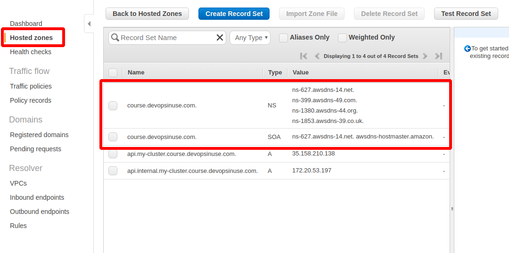
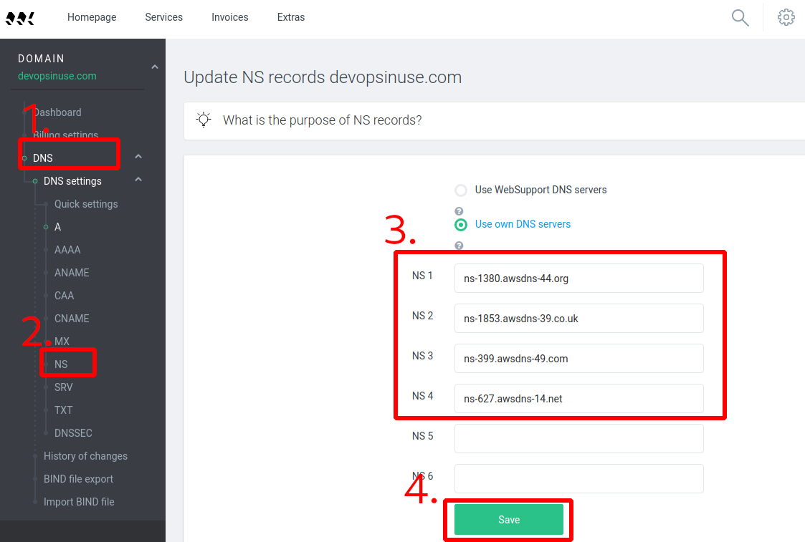
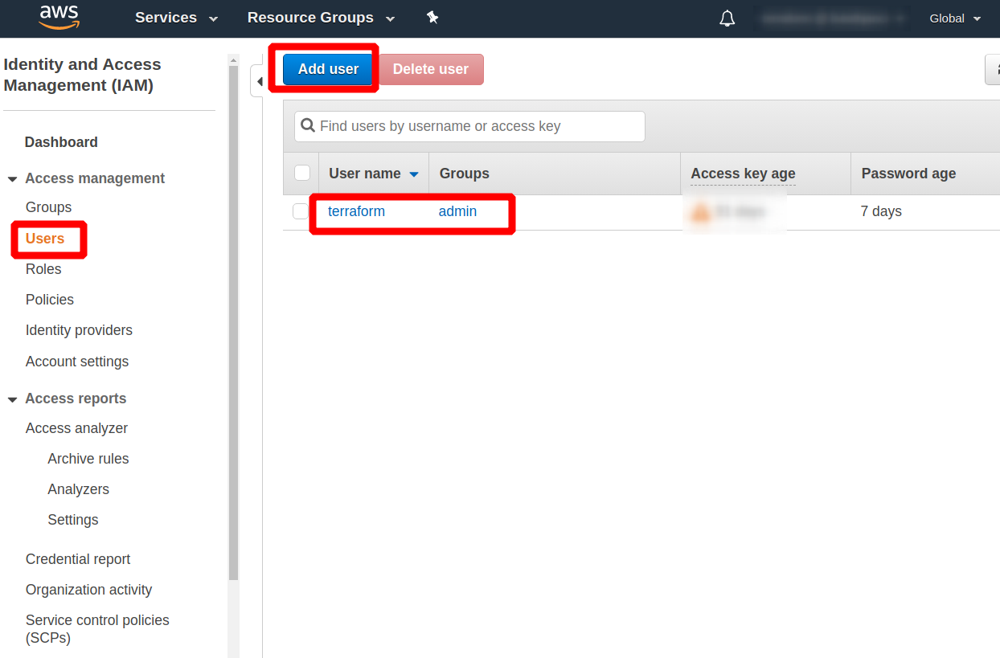
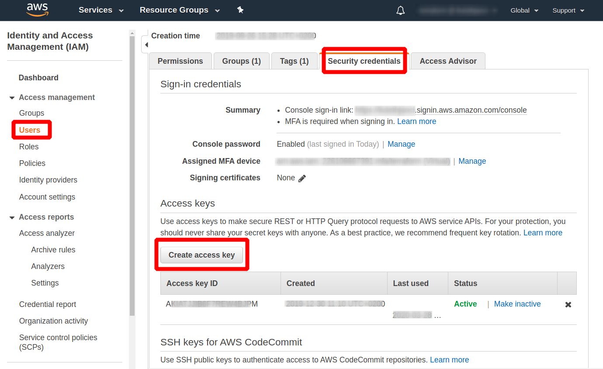

* **Section 1: Introduction**
   - [1. Welcome to course](#1-welcome-to-course)
   - [2. Materials: Delete/destroy all the AWS resources every time you do not use them](#2-materials-deletedestroy-all-the-aws-resources-every-time-you-do-not-use-them)
   - [3. How to start kubernetes cluster on AWS](#3-how-to-start-kubernetes-cluster-on-aws)
   - [4. How to create Hosted Zone on AWS](#4-how-to-create-hosted-zone-on-aws)
   - [5. How to setup communication kops to AWS via aws](#5-how-to-setup-communication-kops-to-aws-via-aws)
   - [6. Materials: How to install KOPS binary](#6-materials-how-to-install-kops-binary)
   - [7. How to install kops](#7-how-to-install-kops)
   - [8. How to create S3 bucket in AWS](#8-how-to-create-s3-bucket-in-aws)
   - [9. Materials: How to install TERRAFORM binary](#9-materials-how-to-install-terraform-binary)
   - [10. How to install Terraform binary](#10-how-to-install-terraform-binary)
   - [11. Materials: How to install KUBECTL binary](#11-materials-how-to-install-kubectl-binary)
   - [12. How to install Kubectl binary](#12-how-to-install-kubectl-binary)
   - [13. Materials: How to start Kubernetes cluster](#13-materials-how-to-start-kubernetes-cluster)
   - [14. How to lunch kubernetes cluster on AWS by using kops and terraform](#14-how-to-lunch-kubernetes-cluster-on-aws-by-using-kops-and-terraform)
<!-- * **Section 2: Jupyter Notebooks**
- [Materials: How to run Jupyter Notebooks locally as Docker image](#materials:-how-to-run-jupyter-notebooks-locally-as-docker-image)
- [How to Jupyter Notebook in Docker on local](#how-to-jupyter-notebook-in-docker-on-local)
- [How to deploy Jupyter Notebooks to Kubernetes AWS (Part 1)](#how-to-deploy-jupyter-notebooks-to-kubernetes-aws-(part-1))
- [Materials: How to deploy Juypyter Notebooks to Kubernetes via YAML file](#materials:-how-to-deploy-juypyter-notebooks-to-kubernetes-via-yaml-file)
- [How to deploy Jupyter Notebooks to Kubernetes AWS (Part 2)](#how-to-deploy-jupyter-notebooks-to-kubernetes-aws-(part-2))
- [How to deploy Jupyter Notebooks to Kubernetes AWS (Part 3)](#how-to-deploy-jupyter-notebooks-to-kubernetes-aws-(part-3))
- [Materials: How to SSH to the physical servers in AWS](#materials:-how-to-ssh-to-the-physical-servers-in-aws)
- [How to deploy Jupyter Notebooks to Kubernetes AWS (Part 4)](#how-to-deploy-jupyter-notebooks-to-kubernetes-aws-(part-4))
- [How to deploy Jupyter Notebooks to Kubernetes AWS (Part 5)](#how-to-deploy-jupyter-notebooks-to-kubernetes-aws-(part-5))
- [Comparison between Jupyter Notebooks running as Docker Conatainer with Kubernete](#comparison-between-jupyter-notebooks-running-as-docker-conatainer-with-kubernete)
- [Materials: Install HELM binary and activate HELM user account in your cluster](#materials:-install-helm-binary-and-activate-helm-user-account-in-your-cluster)
- [Introduction to Helm charts](#introduction-to-helm-charts)
- [Materials: Run GOGS helm deployment for the first time](#materials:-run-gogs-helm-deployment-for-the-first-time)
- [How to use Helm for the first time](#how-to-use-helm-for-the-first-time)
- [How to understand helm Gogs deployment](#how-to-understand-helm-gogs-deployment)
- [Materials: How to use HELM to deploy GOGS from locally downloaded HELM CHARTS](#materials:-how-to-use-helm-to-deploy-gogs-from-locally-downloaded-helm-charts)
- [How to deploy Gogs from local repository](#how-to-deploy-gogs-from-local-repository)
- [Materials: How to understand persistentVolumeClaim and persistentVolumes](#materials:-how-to-understand-persistentvolumeclaim-and-persistentvolumes)
- [How to make you data persistent](#how-to-make-you-data-persistent)
- [Lets summarize on Gogs helm chart deployment](#lets-summarize-on-gogs-helm-chart-deployment)
- [Materials: How to install HELMFILE binary to your machine](#materials:-how-to-install-helmfile-binary-to-your-machine)
- [Introduction to Helmfile](#introduction-to-helmfile)
- [How to deploy Jenkins by using Helmfile (Part 1)](#how-to-deploy-jenkins-by-using-helmfile-(part-1))
- [How to deploy Jenkins by using Helmfile (Part 2)](#how-to-deploy-jenkins-by-using-helmfile-(part-2))
- [Materials: Create HELMFILE specification for Jenkins deployment](#materials:-create-helmfile-specification-for-jenkins-deployment)
- [How to use helmfile to deploy Jenkins helm chart for the first time (Part 1)](#how-to-use-helmfile-to-deploy-jenkins-helm-chart-for-the-first-time-(part-1))
- [Materials: Useful commands Jenkins deployment](#materials:-useful-commands-jenkins-deployment)
- [How to use helmfile to deploy Jenkins helm chart for the first time (Part 2)](#how-to-use-helmfile-to-deploy-jenkins-helm-chart-for-the-first-time-(part-2))
- [Introduction to Prometheus and Grafana deployment by using helmfile (Grafana)](#introduction-to-prometheus-and-grafana-deployment-by-using-helmfile-(grafana))
- [Prometheus and Grafana deployment by using helmfile (Prometheus part)](#prometheus-and-grafana-deployment-by-using-helmfile-(prometheus-part))
- [Prepare Helm charts for Grafana deployment by using helmfile](#prepare-helm-charts-for-grafana-deployment-by-using-helmfile)
- [Prepare Helm charts for Prometheus deployment by using helmfile](#prepare-helm-charts-for-prometheus-deployment-by-using-helmfile)
- [Prepare Helm charts for Prometheus Node Exporter deployment by using helmfile](#prepare-helm-charts-for-prometheus-node-exporter-deployment-by-using-helmfile)
- [Copy Prometheus and Grafana Helm Charts specifications to server](#copy-prometheus-and-grafana-helm-charts-specifications-to-server)
- [Materials: Helmfile specification for Grafana and Prometheus deployment](#materials:-helmfile-specification-for-grafana-and-prometheus-deployment)
- [Process Grafana and Prometheus helmfile deployment](#process-grafana-and-prometheus-helmfile-deployment)
- [Exploring Prometheus Node Exporter](#exploring-prometheus-node-exporter)
- [Explore Promethus Web User Interface](#explore-promethus-web-user-interface)
- [Explore Grafana Web User Interface](#explore-grafana-web-user-interface)
- [LoadBalancer Grafana Service](#loadbalancer-grafana-service)
- [Materials: Helmfile specification to add DokuWiki deployment](#materials:-helmfile-specification-to-add-dokuwiki-deployment)
- [Single LoadBalancer service type for all instances in your K8s (DokuWiki)](#single-loadbalancer-service-type-for-all-instances-in-your-k8s-(dokuwiki))
- [Materials: Helmfile specification to add nginx-ingress Helm Chart deployment](#materials:-helmfile-specification-to-add-nginx-ingress-helm-chart-deployment)
- [Nginx Ingress Controller Pod](#nginx-ingress-controller-pod)
- [Configure Ingress Kubernetes Objects for Grafana, Prometheus and DokuWiki](#configure-ingress-kubernetes-objects-for-grafana,-prometheus-and-dokuwiki)
- [Important: Clean up Kubernetes cluster and all the AWS resources](#important:-clean-up-kubernetes-cluster-and-all-the-aws-resources)
- [Congratulations](#congratulations)  -->

### 1. Welcome to course
### 2. Materials: Delete/destroy all the AWS resources every time you do not use them

Materials **available**:

https://github.com/xjantoth/helmfile-course/blob/master/Content.md


**Note**: I assume that if you are going through this course during several days - You always **destroy all resources in AWS**  It means that you stop you Kubernetes cluster every time you are not working on it. 

The easiest way is to do it via 
```bash
terraform cd /.../.../.../terraform_code;
terraform destroy # hit yes
```


**destroy/delete manually** if terraform can't do that:
   - VOLUMES
   - LoadBalancer/s (if exists)
   - RecordSet/s (custom RecordSet/s)
   - EC2 instances
   - network resources
   -  ...

 except:
   - **S3 bucket**      (delete once you do not want to use this free 1 YEAR account anymore, or you are done with this course.)
   - **Hosted Zone**   (delete once you do not want to use this free 1 YEAR account anymore, or you are done with this course.)
           


Please do not forget redeploy tiller pod by using of this commands every time you are starting your Kubernetes cluster.

Start your Kubernetes cluster
```bash
cd /.../.../.../terraform_code  
terraform apply 
```

Crete service account && initiate tiller pod in your Kubernetes cluster
```bash
kubectl create serviceaccount --namespace kube-system tiller
kubectl create clusterrolebinding tiller-cluster-rule --clusterrole=cluster-admin --serviceaccount=kube-system:tiller
# kubectl patch deploy --namespace kube-system tiller-deploy -p '{"spec":{"template":{"spec":{"serviceAccount":"tiller"}}}}'
helm init --service-account tiller --upgrade
```

### 3. How to start kubernetes cluster on AWS

* **install** binaries:
   - kops
   - terraform v12
   - awscli
* create **S3 bucket** (unique across entire AWS)
* generate **SSH key** pair
* make sure you got your **own domain name**
* create *hosted zone* in AWS (costs $0.50/month)

```bash
SSH_KEYS=~/.ssh/udemy_devopsinuse

if [ ! -f "$SSH_KEYS" ]
then
   echo -e "\nCreating SSH keys ..."
   ssh-keygen -t rsa -C "udemy.course" -N '' -f $SSH_KEYS
else
   echo -e "\nSSH keys are already in place!"
fi

export AWS_ACCESS_KEY_ID=""
export AWS_SECRET_ACCESS_KEY="..."
export AWS_DEFAULT_REGION="eu-central-1"

echo -e "\nCreating kubernetes cluster ...\n"
 
kops create cluster \
--cloud=aws \
--name=course.devopsinuse.com \
--state=s3://course.devopsinuse.com \
--authorization RBAC \
--zones=eu-central-1a \
--node-count=2 \
--node-size=t2.micro \
--master-size=t2.micro \
--master-count=1 \
--dns-zone=course.devopsinuse.com \
--out=terraform_code \
--target=terraform \
--ssh-public-key=~/.ssh/udemy_devopsinuse.pub

cd terraform_code
terraform init
terraform validate                  # -> thrown me some errors
terraform 0.12upgrade         # <- this command fix some of the errors
terraform validate      
sed -i 's/0-0-0-0--0/kops/g' kubernetes.tf

terrafrom validate       # -> this time it passed with no errors
terraform plan
```
### 4. How to create Hosted Zone on AWS

* Navigate to your AWS console and search for **Route 53** - then click at *Hosted Zones*
* My "**Hosted zone**" has already been created *course.devopsinuse.com*
* Create your own **Hosted zone** with the **domain name** you own
* Check on your **4 Name Servers**




Save all your **nameservers** at the providers web page you either purchased the domain or you got the **free domain from**



Use `dig` binary to **determine** that your domain and hosted zone is setup correctly

```bash
dig NS course.devopsinuse.com    

; <<>> DiG 9.16.1 <<>> NS course.devopsinuse.com
;; global options: +cmd
;; Got answer:
;; ->>HEADER<<- opcode: QUERY, status: NOERROR, id: 31746
;; flags: qr rd ra; QUERY: 1, ANSWER: 4, AUTHORITY: 0, ADDITIONAL: 0

;; QUESTION SECTION:
;course.devopsinuse.com.		IN	NS

;; ANSWER SECTION:
course.devopsinuse.com.	172800	IN	NS	ns-1380.awsdns-44.org.
course.devopsinuse.com.	172800	IN	NS	ns-1853.awsdns-39.co.uk.
course.devopsinuse.com.	172800	IN	NS	ns-399.awsdns-49.com.
course.devopsinuse.com.	172800	IN	NS	ns-627.awsdns-14.net.

;; Query time: 203 msec
;; SERVER: 192.168.1.1#53(192.168.1.1)
...
;; MSG SIZE  rcvd: 177

```

### 5. How to setup communication kops to AWS via aws

* Install `awscli` binary 
   * https://docs.aws.amazon.com/cli/latest/userguide/install-linux-al2017.html
* Please configure these two files
   * ~/.aws/credentials
   * ~/.aws/config

Search for **IAM** expression in Free AWS account


Add **User** if you do not have one


Click at a newly created **User** and search for **Security credentials** and **Create access key** section


```bash
vim  ~/.aws/credentials
[terraform]
aws_access_key_id = ...
aws_secret_access_key = ...
```

```bash         
vim ~/.aws/config
[profile terraform]
region=eu-central-1
```

### 6. Materials: How to install KOPS binary

Navigate to: https://github.com/kubernetes/kops/releases/tag/v1.16.0

```bash
sudo curl \
-L --output /usr/bin/kops  \
https://github.com/kubernetes/kops/releases/download/v1.16.0/kops-linux-amd64 && sudo chmod +x /usr/bin/kops
```


### 7. How to install kops 
All `kops` releases: https://github.com/kubernetes/kops/releases/ 

Navigate to: https://github.com/kubernetes/kops/releases/tag/v1.16.0

```bash
which kops

sudo curl \
-L --output /usr/bin/kops  \
https://github.com/kubernetes/kops/releases/download/v1.16.0/kops-linux-amd64 && sudo chmod +x /usr/bin/kops
```


### 8. How to create S3 bucket in AWS

```bash
# create a new bucket
aws s3 mb s3://example.devopsinuse.com --profile terraform
make_bucket: example.devopsinuse.com

# list all buckets
aws s3 ls --profile terraform                            
2018-07-06 12:26:00 course.devopsinuse.com
2020-03-31 15:23:14 example.devopsinuse.com

# remove bucket
aws s3 rb s3://example.devopsinuse.com --profile terraform
remove_bucket: example.devopsinuse.com
```

**Search** for the expression **"S3"** in AWS console


**Create** a new S3 bucket if you do not have one


**Fill up** neceassary details


Hit button **Create bucket**


### 9. Materials: How to install TERRAFORM binary

https://www.terraform.io/downloads.html


```bash
curl -L --output /tmp/terraform.zip  \
https://releases.hashicorp.com/terraform/0.12.24/terraform_0.12.24_linux_amd64.zip

sudo unzip -d /usr/bin/ /tmp/terraform.zip 

terraform -version
Terraform v0.12.24

```

### 10. How to install Terraform binary
https://www.terraform.io/downloads.html


```bash
curl -L --output /tmp/terraform.zip  \
https://releases.hashicorp.com/terraform/0.12.24/terraform_0.12.24_linux_amd64.zip

sudo unzip -d /usr/bin/ /tmp/terraform.zip 

terraform -version
Terraform v0.12.24
```

### 11. Materials: How to install KUBECTL binary
Link: https://kubernetes.io/docs/tasks/tools/install-kubectl/

```bash
curl -LO https://storage.googleapis.com/kubernetes-release/release/v1.18.0/bin/linux/amd64/kubectl
chmod +x ./kubectl
sudo mv ./kubectl /usr/local/bin/kubectl
kubectl version --client
```         


### 12. How to install Kubectl binary
Link: https://kubernetes.io/docs/tasks/tools/install-kubectl/

```bash
curl -LO https://storage.googleapis.com/kubernetes-release/release/v1.18.0/bin/linux/amd64/kubectl
chmod +x ./kubectl
sudo mv ./kubectl /usr/local/bin/kubectl
kubectl version --client
```         

<!-- ### 13. Materials: How to start Kubernetes cluster
### 14. How to lunch kubernetes cluster on AWS by using kops and terraform
### 15. Materials: How to run Jupyter Notebooks locally as Docker image
### 16. How to Jupyter Notebook in Docker on local
### 17. How to deploy Jupyter Notebooks to Kubernetes AWS (Part 1)
### 18. Materials: How to deploy Juypyter Notebooks to Kubernetes via YAML file
### 19. How to deploy Jupyter Notebooks to Kubernetes AWS (Part 2)
### 20. How to deploy Jupyter Notebooks to Kubernetes AWS (Part 3)
### Materials: How to SSH to the physical servers in AWS
### How to deploy Jupyter Notebooks to Kubernetes AWS (Part 4)
### How to deploy Jupyter Notebooks to Kubernetes AWS (Part 5)
### Comparison between Jupyter Notebooks running as Docker Conatainer with Kubernete
### Materials: Install HELM binary and activate HELM user account in your cluster
### Introduction to Helm charts
### Materials: Run GOGS helm deployment for the first time
### How to use Helm for the first time
### How to understand helm Gogs deployment
### Materials: How to use HELM to deploy GOGS from locally downloaded HELM CHARTS
### How to deploy Gogs from local repository
### Materials: How to understand persistentVolumeClaim and persistentVolumes
### How to make you data persistent
### Lets summarize on Gogs helm chart deployment
### Materials: How to install HELMFILE binary to your machine
### Introduction to Helmfile
### How to deploy Jenkins by using Helmfile (Part 1)
### How to deploy Jenkins by using Helmfile (Part 2)
### Materials: Create HELMFILE specification for Jenkins deployment
### How to use helmfile to deploy Jenkins helm chart for the first time (Part 1)
### Materials: Useful commands Jenkins deployment
### How to use helmfile to deploy Jenkins helm chart for the first time (Part 2)
### Introduction to Prometheus and Grafana deployment by using helmfile (Grafana)
### Prometheus and Grafana deployment by using helmfile (Prometheus part)
### Prepare Helm charts for Grafana deployment by using helmfile
### Prepare Helm charts for Prometheus deployment by using helmfile
### Prepare Helm charts for Prometheus Node Exporter deployment by using helmfile
### Copy Prometheus and Grafana Helm Charts specifications to server
### Materials: Helmfile specification for Grafana and Prometheus deployment
### Process Grafana and Prometheus helmfile deployment
### Exploring Prometheus Node Exporter
### Explore Promethus Web User Interface
### Explore Grafana Web User Interface
### LoadBalancer Grafana Service
### Materials: Helmfile specification to add DokuWiki deployment
### Single LoadBalancer service type for all instances in your K8s (DokuWiki)
### Materials: Helmfile specification to add nginx-ingress Helm Chart deployment
### Nginx Ingress Controller Pod
### Configure Ingress Kubernetes Objects for Grafana, Prometheus and DokuWiki
### Important: Clean up Kubernetes cluster and all the AWS resources
### Congratulations -->
